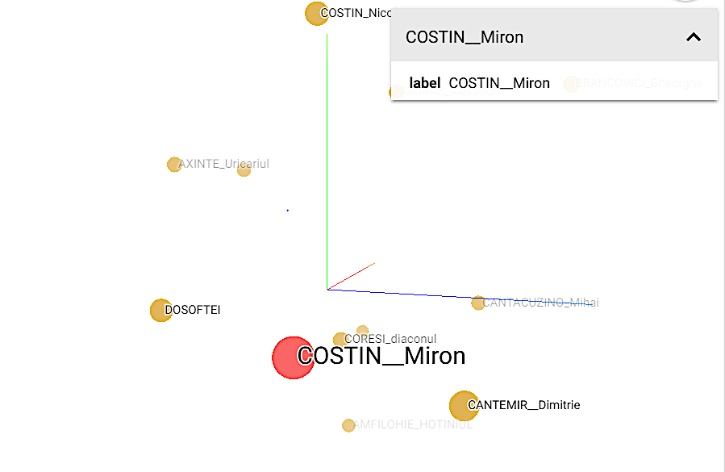

# Similarity between Romanian authors

Article cand be found [here](SemanticAuthorRecommendations.pdf)

### Results for the most important authors:

| Authors            | Dimitrie Cantemir | Vasile Alecsandri | Ion Creangă | Ion Luca Caragiale | Tudor Arghezi | George Bacovia | Ion Barbu | Lucian Blaga | Emil Cioran |
|--------------------|-------------------|-------------------|-------------|--------------------|---------------|----------------|-----------|--------------|-------------|
| Dimitrie Cantemir  | -                 | 0.393             | 0.462       | 0.467              | 0.47          | 0.62           | 0.4       | 0.38         | 0.392       |
| Vasile Alecsandri  |                   | -                 | 0.354       | 0.206              | 0.352         | 0.37           | 0.294     | 0.376        | 0.414       |
| Ion Creangă        |                   |                   | -           | 0.33               | **0.195**         | 0.355          | 0.274     | 0.394        | 0.248       |
| Ion Luca Caragiale |                   |                   |             | -                  | 0.311         | 0.476          | 0.318     | 0.517        | 0.394       |
| Tudor Arghezi      |                   |                   |             |                    | -             | 0.23           | **0.115**     | 0.332        | 0.35        |
| George Bacovia     |                   |                   |             |                    |               | -              | 0.211     | 0.373        | 0.459       |
| Ion Barbu          |                   |                   |             |                    |               |                | -         | 0.281        | 0.299       |
| Lucian Blaga       |                   |                   |             |                    |               |                |           | -            | 0.273       |
| Emil Cioran        |                   |                   |             |                    |               |                |           |              | -           |

### Most similar authors with *Miron Costin* - using only descriptions

| Author name                        | Distance |
|------------------------------------|----------|
| Dimitrie Cantemir                  | 0.24     |
| Dosoftei                           | 0.258    |
| Nicolae Costin                     | 0.285    |
| Uricariul Axinte                   | 0.355    |
| Antim Ivireanul                    | 0.379    |
| Mihai Cantacuzino                  | 0.411    |
| Teodor Corbea                      | 0.412    |
| Constantin Cantacuzino (stolnicul) | 0.421    |
| Crimca Anastasie                   | 0.425    |

### Most similar authors with *Miron Costin* - using all features

| Author name         | Distance |
|---------------------|----------|
| Nicolae Costin      | 0.125    |
| Dimitrie Cantemir   | 0.128    |
| Gheorghe Brancovici | 0.151    |
| Dosoftei            | 0.16     |
| Uricariul Axinte    | 0.162    |
| Teodor Corbea       | 0.17     |
| Alexandru Amiras    | 0.184    |
| Ioan Cantacuzino    | 0.192    |
| Mihai Cantacuzino   | 0.197    |

### Most similar authors with *Miron Costin* - tensorboard visualization - using only descriptions

